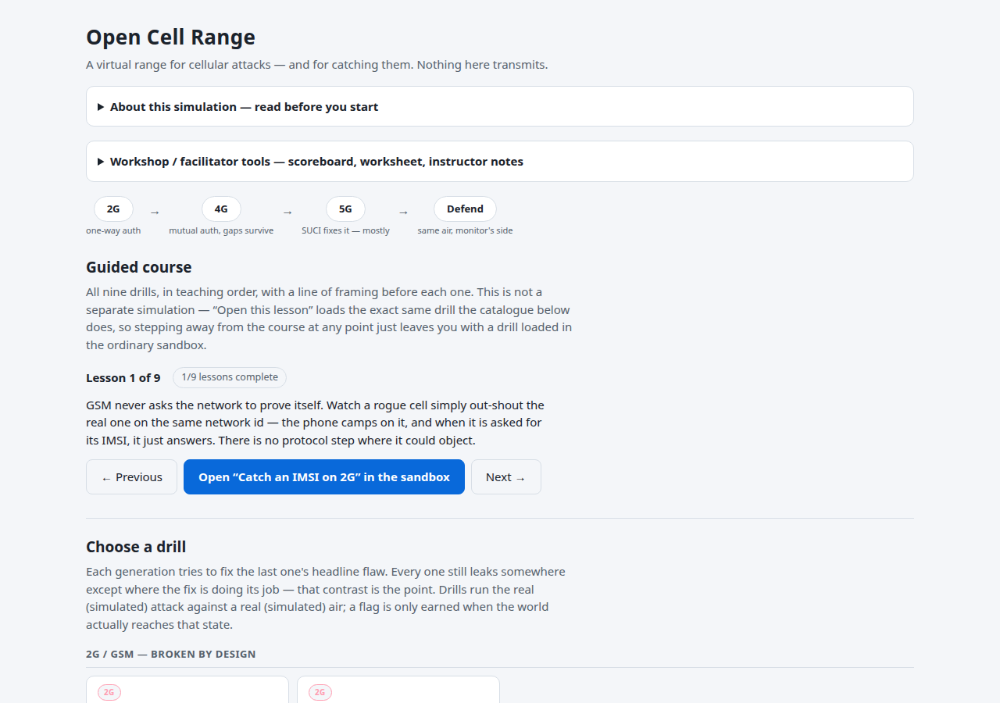
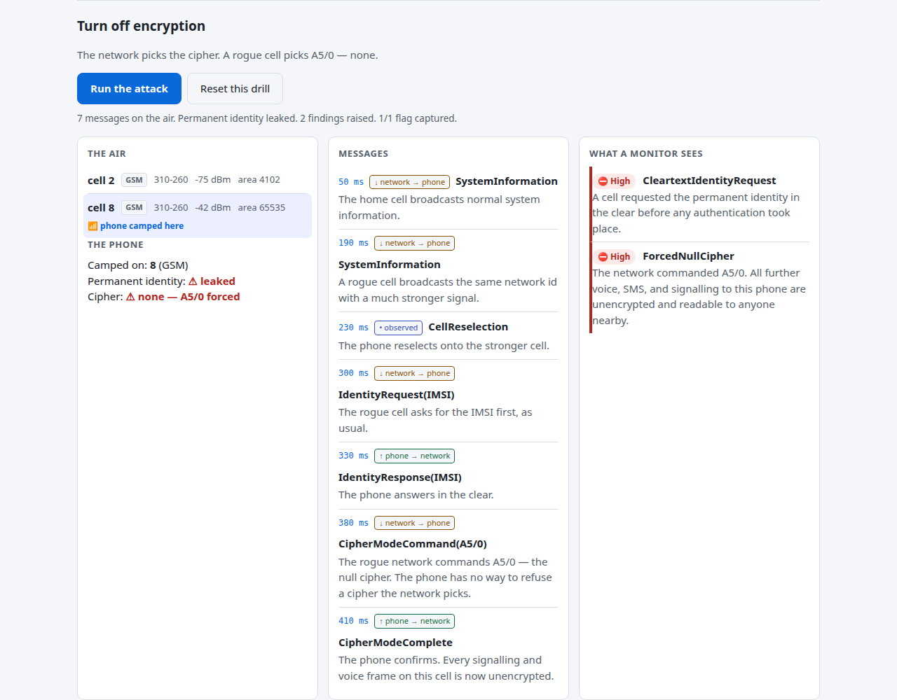

# Open Cell Range

**A browser-based virtual range for cellular network attacks — and for catching them.**
No SDR, no SIM, no spectrum. A simulated phone, cell towers, and core network let you stand
up rogue base stations, catch IMSI-catcher and downgrade attacks, and then switch sides and
run the same passive monitor a real detector would — across the full 2G → 4G → 5G arc,
entirely in a browser tab.



It's the cellular sibling of [Open Door Range](https://github.com/holdTheDoorHoid/open-door-range)
(physical access control — Wiegand and OSDP) and pairs with
[Rayhunter](https://github.com/EFForg/rayhunter), the EFF's on-device cell-site-simulator
detector: the passive-monitor logic that raises a finding here is the same reasoning a
Rayhunter-class detector applies to a real capture. Learn how the attack works safely in the
browser, then go recognize it in the world.

> **This is a simulation for defensive education.** Nothing is ever transmitted — the radio
> world is a data structure in memory; there is no SDR, no baseband, no antenna, and no code
> path that could drive any of those. See [`docs/ETHICS.md`](docs/ETHICS.md).

## Why this exists

Understanding how an IMSI catcher works has historically required an SDR, a shielded room to
stay legal, and enough RF background not to brick your own understanding on the first
misconfigured parameter. That gate keeps the subject in the hands of people who already have
a lab. Open Cell Range removes the gate: the same attack and defense logic that would run
against real spectrum runs here against a simulated one, so anyone can learn what a rogue base
station actually does — and what it looks like from a defender's side — with nothing but a
browser tab.

## The arc it teaches

The whole project answers one question three times, one generation at a time: **can the phone
tell a real network from a fake one, and can an eavesdropper recover the permanent identity
that names the human carrying it?**

| Generation | The lesson |
|-----------|------------|
| **2G / GSM** | One-way authentication and optional/null encryption: the phone can't tell a real tower from a fake one, and the IMSI is handed over on request. Broken by design. |
| **4G / LTE** | Mutual authentication closes the headline attack — but the IMSI still leaks in the clear before security starts, unprotected reject messages let an attacker force a downgrade back to 2G, and IMSI-paging alone confirms a target's presence. |
| **5G / NR** | SUCI encrypts the permanent identity before it ever reaches the air, killing the classic catcher — yet it's an optional protection scheme, it's downgradable, and even an intact SUCI leaks presence through the AKA failure-message oracle. |

For every attack, the defensive half — a passive monitor built on the same engine — shows
exactly what a real detector would conclude from the same air. Nine drills across four
tracks; the full list is below.

## Try it

**Live, no install:** <https://holdthedoorhoid.github.io/open-cell-range/>

**Locally, no Rust toolchain** (runs on the JavaScript reference engine):

```bash
git clone https://github.com/holdTheDoorHoid/open-cell-range.git
cd open-cell-range
python3 -m http.server -d site 8000
# then open http://localhost:8000
```

**Locally with the real engine** (the same Rust code, compiled to WebAssembly):

```bash
cargo install wasm-pack
wasm-pack build crates/ocr-wasm --target web --out-dir ../../site/pkg
python3 -m http.server -d site 8000
```

`site/js/app.js` imports the wasm engine and transparently falls back to the JavaScript
reference engine if `site/pkg` hasn't been built, so the site works either way — and the two
engines are provably interchangeable through one frozen contract:
[`site/ENGINE-API.md`](site/ENGINE-API.md).

## Three ways to use it

- **Guided course** — all nine drills in teaching order, with a line of framing before each
  one, a visible `Lesson N of 9`, and a completed-lesson count that persists in this browser.
  It is not a second simulation bolted on top: "Open this lesson" loads the exact same drill
  the free catalogue does, so you can leave the course at any point and land in the ordinary
  sandbox with that drill still loaded.
- **Sandbox** — pick any drill straight from the catalogue, run its attack (or its monitor, on
  the defend track), reset it, and tinker: step the engine's virtual clock forward by a chosen
  amount, or reload the scenario and replay its attack in one click. Every control is labelled
  by exactly what it calls on the engine.
- **Workshop / facilitator mode** — a local, no-account CTF-style scoreboard of flags captured
  across all nine drills, an optional instructor-notes overlay with cues for what to point out
  on each one, and a print-friendly worksheet for a room that wants paper. All of it lives in
  this browser's local storage only — nothing is collected and there is no backend, matching
  the project's [ethics posture](docs/ETHICS.md).



## The nine drills

| Track | Drill | Teaches |
|---|---|---|
| 2G | Catch an IMSI on 2G | One-way auth: a rogue cell just asks, and the phone just answers. |
| 2G | Turn off encryption | The network — not the phone — picks the cipher, and can pick none. |
| 4G | Catch an IMSI on LTE | Mutual auth closes the headline hole, but the IMSI still leaks pre-security. |
| 4G | Force a downgrade to 2G | Unprotected reject messages steer a phone back to a broken generation. |
| 4G | Confirm a target is nearby | No rogue cell needed — IMSI paging alone confirms presence (ToRPEDO/PIERCER). |
| 5G | SUCI does its job | The fix, working: the identical attack shape recovers nothing readable. |
| 5G | Undo SUCI with the null scheme | SUCI's protection is a configuration choice, and it's legal to turn off. |
| 5G | Is this challenge theirs? | SUCI holds, but a replayed AUTN's failure type still links a sighting to a subscriber. |
| Defend | Spot the catcher | Read an air log after the fact and run the same monitor a real detector would. |

## How it's built

One Rust engine (`crates/`), compiled to WebAssembly for the browser and reused as-is for a
command-line capture analyser — so the teaching simulation and the real-capture analyser are
provably the same code, and a drill can never teach something the analyser disagrees with.
Everything is deterministic: a virtual microsecond clock and a seeded RNG, no wall clock and
no OS entropy, so every scenario and every flag is exactly reproducible. The front end
(`site/`) is plain static HTML/CSS/ES modules — no framework, no bundler, no external CDN —
and talks to the engine through exactly one contract.

Read more:

- [`DESIGN.md`](DESIGN.md) — the authoritative design spec and crate map.
- [`docs/PROTOCOL.md`](docs/PROTOCOL.md) — the protocol reference: every identifier and
  authentication story the drills model, with standards citations.
- [`docs/DETECTION.md`](docs/DETECTION.md) — the defender's cheat sheet: what the passive
  monitor concludes from each attack, and what else, entirely innocent, triggers the same
  finding.
- [`docs/CURRICULUM.md`](docs/CURRICULUM.md) — the teaching arc each drill, and the guided
  course, draws from.
- [`docs/ETHICS.md`](docs/ETHICS.md) — what this is, what it deliberately is not, and why.
- [`site/ENGINE-API.md`](site/ENGINE-API.md) — the frozen contract between the site and the
  engine, and the reference JavaScript implementation of it.

## License

GPLv3. Copyleft keeps this from being absorbed into a closed vendor training product. The
project is free and open — the work around it (workshops, instructor material, and the
capture hardware it eventually pairs with) is where [LSOH](https://github.com/holdTheDoorHoid)
earns its keep.
